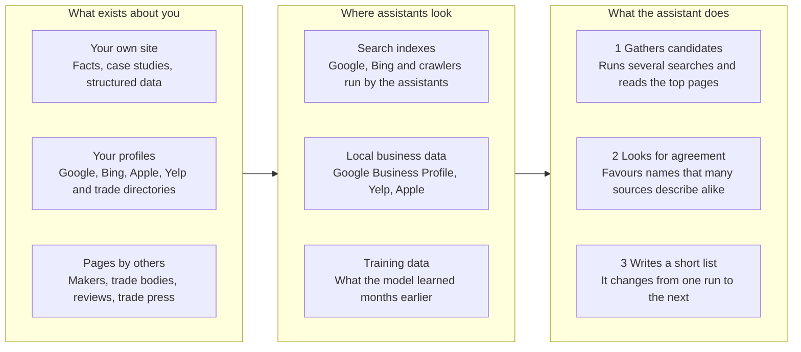
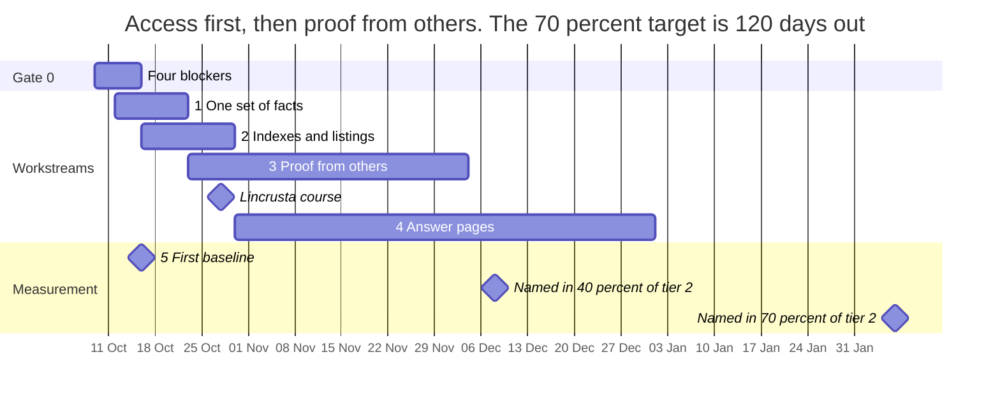

# Mr Wallcover AI visibility plan: repository edition

Exported on 9 October 2026 from the owner's working plan. Prepared by Claude for Dorin Burcus, founder of Mr Wallcover.

> **This repository is public, so this edition leaves four things out.** They stay in the owner's private copy of the plan.
>
> 1. Where private material sits in this repository.
> 2. The statements on the site that await the owner's attention.
> 3. The maker-by-maker outreach list and the message that goes with it.
> 4. The names of competitors.
>
> Everything else is the plan as written: every action, the measurement routine, the evidence and the sources. "You" in the text is the owner.
>
> The measurement kit (six files) and the seven content drafts were delivered to the owner separately. They are not part of this file.

Mr Wallcover can realistically be named in most AI answers to a defined set of specialist wallcovering prompts within about four months, and named first in many of them. Today assistants have little to go on: the site went live on 9 October, its secure (https) address was not yet active when I tested it, and a search for the name finds its own public code repository and nothing else about the business.

## A. Executive summary

No one can guarantee first place in an AI answer, because there is no fixed list: the same question returns a different set of names almost every time it is asked. What can be won, and measured, is the share of answers that name Mr Wallcover. This plan aims for at least 70% of answers to 15 specialist prompts by early February 2027, pooled across four assistants. For broad prompts such as "best wallpaper installer in London" it aims for 20% by the same date and 50% within a year. Those are planning targets, not forecasts.

**Where you stand on 9 October 2026**

| Finding | Evidence | Effect |
| --- | --- | --- |
| The site is well built, and changing by the hour | At 18:34 on 9 October (commit 0c85c86) it had 54 indexable pages in plain HTML, each with a unique title, a description and machine-readable business details, plus 16 case studies. At 16:03 it had 37 pages. At 18:13 another session added a fact sheet, a founder entry and dates on the case studies. | Little on-site rework is needed. Site figures in this plan carry a time for that reason. |
| https was not active when I tested | GitHub records the published address as http://www.mrwallcover.com on every deploy I checked, the latest at 18:19. One secure request from my workspace received a certificate that did not match the domain. The site was three hours old, and GitHub may still have been issuing the certificate. | Until https works, an assistant or search engine that asks for the secure address gets nothing |
| I found nothing else on the web about the business | Searches for "Mr Wallcover" and "Dorin Burcus" returned no result about it. A US installer called "Mr. Wallcovering" came up instead. At 18:00 a search for mrwallcover returned ten results, and nine were the code repository and its pull requests. | Assistants have nothing to check your claims against, and may confuse the name |
| The site's code repository is public | It holds material that was never meant to be public. The detail is in the owner's private copy. | A privacy and reputation risk that anyone, and any assistant, can read. It is also what a search for the name returns. |

**The strategy.** Assistants recommend the business that several sources they trust already describe in the same way. Your advantage is real work with named makers and hotels: Calico Wallpaper, House of Hackney, Timorous Beasties, Vescom, Brown's Hotel, The OWO. Today only your own site says so. The plan gets the makers, trade bodies, review sites and trade press to say it too, then adds pages that answer the exact questions buyers ask.

**The order of work**

1. By Friday 16 October: check your GitHub plan, make the repository private, get https working, and review three statements on the site.
2. By 30 October: agree one set of business facts, then set up Google Business Profile, Bing, Apple, Yelp and the core UK directories.
3. From 23 October to early December: maker credits and referral lists, the first Lincrusta training day on 28 October, trade body applications, the first 10 reviews.
4. From 30 October to the new year: maker installer pages, a fuller trade page, a cost guide with real figures, a reviews page, and the three studies and four makers' notes drafted on 9 October.
5. Every month: collect answers to the prompt panel and score them with the measurement kit sent alongside this plan.

**Decisions I need from you**

1. Which legal identity stands behind Mr Wallcover, and the year it began trading under that name.
2. Whether the SITE_PHONE secret exists. Without it the live site shows no phone or WhatsApp button. After that, whether to publish a dedicated number that machines can read.
3. A private repository on a paid GitHub plan, or a move to a host that builds from private code. This one is urgent. On GitHub's free plan, switching to private takes the website offline, so upgrade first.
4. A point of wording about a credential, set out in the private copy.
5. A point of wording about project roles, set out in the private copy.
6. Real price ranges for a cost guide.
7. Whether I should open a pull request for the backlog that pull request 15 left: IndexNow, analytics and the source field on the enquiry form.
8. Whether the complete plan may sit in the public repository. Only a repository edition is there now.

## B. Assumptions and scope

This plan covers unpaid recommendation and citation by AI assistants: ChatGPT, Google's AI Overviews, AI Mode and Gemini, Microsoft Copilot, Claude, Perplexity, Grok and Apple's search surfaces. Advertising inside those products is out of scope.

**Taken as given, not verified by me**

- Every business fact comes from the site's code and the owner's four answers. I did not check them against outside records.
- I audited the code four times: commit e054edd at 16:03, 1f99a41 at 17:41, 38bcc5b at 18:17 and 0c85c86 at 18:34. The third was already four minutes behind the main branch when I ran it. Every site figure in this plan carries a time.
- The privacy notice says the site is run by Dorin Burcus trading as Mr Wallcover. I have treated the business as a sole trader with no company registered under that name.
- The focus, from your answers: installation, trade and commercial supply, and close work with manufacturers. London first, the rest of the UK second.

**What I could not do**

- Read the live site. Every finding about its pages comes from building the same code myself.
- Ask ChatGPT, Gemini, Copilot, Perplexity or Grok anything. The baseline for those has to be collected by you or your own agents; the kit scores whatever is collected.
- Open most of the makers' own pages.
- Use a commercial AI visibility tracker. None was available to me.

**Unknowns that change the plan**

| Unknown | Why it matters |
| --- | --- |
| Whether https works now | Everything else waits on it |
| Whether a Google Business Profile already exists | It is the largest single source behind Google's AI answers for local businesses |
| The state of the Instagram account @mrwallcover | It is the only outside profile the site links to |
| Whether past clients will give named reviews | Reviews are the signal that is hardest to replace |
| Insurance, CSCS cards and accreditations held | Trade buyers screen on these before they shortlist |
| Budget for paid listings and memberships | It decides Checkatrade, trade press profiles and trade bodies |

## C. How assistants choose, and the 2030 target

Every assistant builds its answer from two things: what it can retrieve at that moment, and which names several trusted sources agree on. None of them keeps a list you can apply to join.



*The assistant names the firms that other sources confirm.*

Only the first column, what exists about you, is in your hands. Of its three boxes, pages by others carries the most weight, and I found none.

| Assistant | Where its candidates come from | What you control |
| --- | --- | --- |
| ChatGPT | Its own index, built by a crawler called OAI-SearchBot, plus outside search providers ([OpenAI](https://developers.openai.com/docs/gptbot), [help page](https://help.openai.com/en/articles/9237897-chatgpt-search)). Research by [Peec](https://docs.peec.ai/research/chatgpt-search-result-providers) in September 2026 found Google and Microsoft results behind it, with Yelp and Tripadvisor as licensed local data. | Crawl access, Google and Bing indexing, a Yelp profile, outside pages that name you |
| Google AI Overviews, AI Mode, Gemini | Google's index and Business Profiles. Google says a page only needs to be indexed and eligible for a snippet ([AI features](https://developers.google.com/search/docs/appearance/ai-features)), and that Business Profiles "can help your products and services to be visible" in AI responses ([guide, July 2026](https://developers.google.com/search/docs/fundamentals/ai-optimization-guide)). | Search Console, Google Business Profile, reviews |
| Microsoft Copilot | Bing's index. [Microsoft](https://blogs.bing.com/webmaster/2026/2/Introducing-AI-Performance-in-Bing-Webmaster-Tools-Public-Preview/) tells local firms to register with Bing Places. | Bing Webmaster Tools, Bing Places |
| Claude | Two crawlers, Claude-SearchBot and Claude-User, fetch pages ([Anthropic](https://support.claude.com/en/articles/8896518-does-anthropic-crawl-data-from-the-web-and-how-can-site-owners-block-the-crawler)). Its results have been reported to match Brave Search; Anthropic has not confirmed this ([summary](https://geotoolbox.ai/blog/claude-seo)). | Crawl access, links from pages other engines index |
| Perplexity | Its own index, built by PerplexityBot, plus live fetches ([Perplexity](https://docs.perplexity.ai/guides/bots)) | Crawl access |
| Grok | Web search and posts on X ([xAI](https://docs.x.ai/docs/tools/overview)) | Crawl access |
| Apple Maps, Spotlight, Safari | Place cards managed in Apple Business, a free service launched on 14 April 2026 ([Apple](https://apple.com/newsroom/2026/03/introducing-apple-business-a-new-all-in-one-platform-for-businesses-of-all-sizes)) | Claim the place card |

**What the evidence says**

- **Lists do not repeat.** In nearly 3,000 runs of 12 prompts, the chance of getting the same list of brands twice was under 1 in 100. The share of answers that include a brand is the figure that holds up ([SparkToro and Gumshoe, January 2026](https://searchengineland.com/ai-recommendation-lists-rarely-repeat-study-468076)).
- **Other people's pages outweigh your own.** A [September 2025 study](https://arxiv.org/abs/2509.08919) found AI search shows "a systematic and overwhelming bias towards Earned media" over brand-owned pages.
- **Mentions track visibility more closely than links or page count.** Across 75,000 brands, AI visibility correlated with YouTube mentions (about 0.74) and web mentions (0.66 to 0.71) far more than with domain strength (0.27 to 0.33) or number of pages (about 0.19). The sample was large brands, and a correlation is not a cause ([Ahrefs, December 2025](https://ahrefs.com/blog/ai-brand-visibility-correlations)).
- **For local firms, the business profile leads.** Google Business Profile was 28.5% of 1.97 million citations across Google's AI answers and ChatGPT; Yelp appeared in 80% of ChatGPT's local answers. The study pooled the US, UK and Australia and does not break out the UK ([BrightLocal, August 2026](https://www.brightlocal.com/resources/ai-directory-sources/)).
- **Local search specialists agree.** "3 of the top 5 AI Search visibility factors are citation factors" ([Whitespark, November 2025](https://whitespark.ca/local-search-ranking-factors/), 47 experts). In local search, a citation means a listing or mention of the business on another site.
- **Sources shift without warning.** Around 20 August 2026, Reddit fell from 41.7% of ChatGPT's citations for local services to 0.0%. Gemini and ChatGPT named the same top business on fewer than 5% of queries ([Steady Demand, US data](https://www.steadydemand.com/?p=4957)).
- **Plain facts get quoted.** In tests, adding quotations, statistics and cited sources raised visibility by up to about 40%; keyword stuffing lowered it ([Aggarwal et al.](https://arxiv.org/abs/2311.09735)).
- **llms.txt is optional.** 97% of llms.txt files received no requests in May 2026 ([PPC Land, July 2026](https://ppc.land/llms-txt-adoption-rises-8-8x-but-97-of-files-get-zero-ai-requests/)), and Google says its search does not use such files. Yours does no harm; it is not a lever.

**The 2030 target and today's path.** My working assumption for 2030, which no source can confirm, is that many shortlists will be drawn up by software acting for a designer, a main contractor or a hotel project team. It will not read marketing copy. It will check facts it can verify: what you install, for which makers, on which named projects, with which accreditations, and whether someone else confirms each one. Then it will ask for a price in a structured way. If that is right, the lasting asset is a verifiable record of the business, not a ranking.

| By 2030 | Put in place now |
| --- | --- |
| A machine-readable record that software trusts | One fact sheet in the repository that feeds the site's structured data, llms.txt and every outside profile. Pull request 15 added it at 18:13 on 9 October, as src/data/facts.json. |
| Claims confirmed by third parties | Maker credits, approved-installer listings, trade body membership, named reviews |
| Evidence attached to each project | Case studies with dates, scope, makers, press links and a client-side contact who can confirm |
| A structured way to ask for a price | The enquiry form that went live on 9 October already asks who is asking, how many rooms, who supplies the material and the programme. Keep its fields in step with what a tender needs. |
| Proof that it works | The prompt panel, Bing's AI Performance report, referral data |

## D. The plan

The plan is one gate and five workstreams. The dates are planning dates counted from 9 October 2026.



Gate 0 and the first two workstreams finish inside three weeks. Proof from others runs to early December and the new pages to the new year. The two measured targets fall on 8 December and 6 February.

### Gate 0: clear four blockers by 16 October

Nothing after this section works until item 1 is done. Item 2 is the most urgent.

1. **Get https working.**
   - Found: GitHub records the address as http://www.mrwallcover.com on every deploy I checked, the latest at 18:19 on 9 October. That shows the "Enforce HTTPS" setting is off. One secure request from my workspace also received a certificate that did not match the domain; I saw that through a network proxy, so treat it as a sign, not proof.
   - Likely cause: the site was three hours old. GitHub issues the certificate after its DNS check, and the repository's own notes say it was still being issued.
   - Not the cause: DNS. The www name points to wr1now.github.io and the bare domain to GitHub's four addresses, with no conflicting records.
   - Fix: in GitHub open the repository's Settings, then Pages. If "Enforce HTTPS" can be ticked, tick it. If it is still greyed out a day after launch, remove the custom domain, type it again and save. [GitHub says](https://docs.github.com/en/pages/getting-started-with-github-pages/securing-your-github-pages-site-with-https) this restarts the certificate request.
   - Done when: the access check in the kit exits with 0, https://www.mrwallcover.com/robots.txt opens with a padlock, and the http address redirects to it.
2. **Make the code repository private, after checking your GitHub plan.**
   - Found: material that should not be public. The detail is in the owner's private copy.
   - Found at 18:00 on 9 October: a search for the name returned this repository and eight of its pull requests. The repository was still public at 18:39.
   - Check first: open Settings, then Billing and plans. GitHub serves a Pages site from a private repository only on a paid plan. Its page says Pages is available "in public repositories with GitHub Free" and "in public and private repositories with GitHub Pro" and above ([GitHub](https://docs.github.com/en/pages/getting-started-with-github-pages/what-is-github-pages)). On the free plan the website goes offline when the repository turns private.
   - Fix today: on a paid plan, make wr1now/mrwallcover-site private. On the free plan, upgrade to Pro first. The alternative is to move hosting to Netlify or Cloudflare Pages, which build from private code.
   - If it must stay public: remove the material, rewrite the history, and ask GitHub Support to purge the old commits.
   - Until it is private, keep internal documents out of it. That is why this file is a repository edition.
   - Done when: the repository page shows "not found" to a signed-out browser, and the website still opens.
3. **Check three statements on the site against the records.**
   - Three statements on the site need the owner's attention. They are listed in the private copy. A fourth was corrected at 18:13 on 9 October.
   - Done when: every claim on the site matches a record you could show a client.
4. **Check the phone secret, then decide how machines see the number.**
   - Found: since 18:13 the number is no longer in the code. The site reads it from a secret named SITE_PHONE each time it is built. Without the secret, the site is built with no phone button and no WhatsApp button. My own build, which has no secret, had neither.
   - Check now: in GitHub open Settings, then Secrets and variables, then Actions. If SITE_PHONE is not listed, add it and run the deploy again. I cannot see your secrets.
   - Decide: publish a dedicated business number in listings and structured data, or keep it click-to-reveal only and accept thinner listings. Use a number that belongs to this business alone, because listing platforms can confuse two businesses that share one.
   - Done when: the live site shows the phone button, and you have decided whether a number goes into listings.

Item 3 matters because assistants compare sources, and so do procurement teams. One statement that a hotel or a main contractor can refute costs more trust than the claim earned.

### Workstream 1: one set of facts, used everywhere

Assistants match a business by its name, place, founder and a description that stays the same from source to source. Yours has two weaknesses: almost no outside record, and a near-namesake in the US.

**1.1 Agree the fact sheet.** One file in the repository becomes the only source for the footer, the structured data, llms.txt and the text pasted into every outside profile. Pull request 15 added that file, src/data/facts.json, at 18:13 on 9 October. It holds the name, one description, the founder, the email address, the place, the coverage and one outside profile. These are the fields still to settle:

| Field | Today | Action |
| --- | --- | --- |
| Name | Mr Wallcover | Always this spelling. On first mention anywhere, add "London" and "founded by Dorin Burcus". |
| One-line description | One sentence in the fact sheet, which the home page description now uses | Check the sentence in the fact sheet, then reuse it unchanged everywhere |
| Legal identity | "Dorin Burcus, trading as Mr Wallcover", on the privacy page only | Decision 1, then state it on the About page and in the structured data |
| Trading since | Not stated. "In the trade since 2014" describes you, not the name. | Add the year the name was first used |
| Location | "London" | A service-area business: no public street address, a list of boroughs for listings |
| Phone | Read from a build secret since 18:13. Click-to-reveal for people, hidden from machines | Decision 2 |
| Outside profiles | Instagram only | Add each profile from workstream 2 as it goes live |
| Makers worked with | Ten makers with a documented job, across 16 published case studies. Cover Styl' is training only. | List each maker with the project that proves it |
| Credentials | Solar Screen and Cover Styl' training | Add insurance, site cards, memberships and approvals as they are gained |

**1.2 Strengthen the structured data.** Pull request 15 added an entry for the founder on every page and, on every case study, a published date, an updated date and the founder as author. Still to add, once you have decided them:

- A link to every live outside profile.
- The legal name and the year the name was first used.
- The phone number, if you make it readable by machines.
- Memberships, credentials and the award, only when each is real and named. Google's guidance is that structured data must match the visible text.

**1.3 Make the About page the reference page for the business.** It runs to 270 words. Add dated career facts, training, memberships, a photograph of you at work, and a link to every outside profile.

**1.4 Guard the name.** A US installer is listed on Thumbtack as ["Mr. Wallcovering"](https://www.thumbtack.com/sc/greenville/furniture-assembly/mr-wallcovering/service/551473024847011843). It was the first result when I searched for your site, and the search result showed more than 140 reviews. Take the same handle on every platform, and keep "London" in the first sentence of each profile.

Done when: the site, llms.txt and every profile carry the same sentence, and a search for the name returns your own profiles.

### Workstream 2: be in every index and local data source

An assistant can only recommend what its own sources hold. Start these once https works. All are free unless marked.

| Source | Feeds | Action | Why |
| --- | --- | --- | --- |
| Google Search Console | Google Search, AI Overviews, AI Mode | Verification by HTML tag is already in the code. Once https works, also add a Domain property, which covers every version of the address through one DNS record at names.co.uk. Submit the sitemap, and inspect the home page and three key pages. | Google's AI answers draw only on indexed pages |
| Google Business Profile | Google's AI answers, Gemini, Maps | Create it as a service-area business: the wallpaper installer category if offered, borough-level service areas, your own site photographs, the one-line description. Google verifies with a [live video recording](https://support.google.com/business/answer/14271705?hl=en) that shows your working area, your tools and proof that you run the business. | The largest single source in BrightLocal's study, at 28.5% of citations. Google's own guide says Business Profiles help visibility in AI responses. |
| Bing Webmaster Tools | Bing, Copilot, and one of ChatGPT's providers | Import the site from Search Console and submit the sitemap. Add IndexNow, a signal that tells Bing each time a page changes. | Microsoft reports Copilot citations here |
| Bing Places | Bing local results, Copilot | Create the listing from the fact sheet | Microsoft's own advice to local firms |
| Apple Business | Apple Maps, Spotlight, Safari | Claim the place card | A free service since 14 April 2026 |
| Yelp | ChatGPT's local answers | Claim the free business page | In 80% of ChatGPT's local answers in BrightLocal's pooled US, UK and Australian data, and named by Peec as licensed local data |
| Yell, Trustpilot, Houzz, Facebook, LinkedIn | Background citations | Create each from the fact sheet, with five of your own photographs | All five appear among BrightLocal's cited sources, at small shares. LinkedIn is also where trade buyers check a contractor. |
| Instagram | Google and Bing results | Confirm that @mrwallcover is a public professional account, with search-engine visibility switched on under Settings, Privacy | Since July 2025 search engines can show public posts from professional accounts ([PPC Land](https://ppc.land/instagram-content-becomes-searchable-on-google-starting-july-10/)). Instagram refused my fetch tool, and I would expect AI crawlers to fare the same, so repeat on the site any fact that lives only in a post. |
| Checkatrade or TrustATrader (paid) | Lists that other sites compile | Join one, once you have clients ready to review you there | A [UK installer list](https://oliveetoriel.com/pages/wallpaper-installers-united-kingdom) published by an Australian wallpaper retailer is compiled from top-rated members of these two and from WIA members |

**The AI crawlers need no submission.** They only need not to be blocked. Your robots.txt already admits all of them, and keeps only the thank-you page out. Two cautions:

- GitHub Pages gives you no visitor logs, so you cannot see which crawlers arrive. A host with logs fixes that.
- If you ever put Cloudflare in front of the site, check its AI crawler setting first. Cloudflare announced in July 2025 that it blocks AI crawlers by default ([MIT Technology Review](https://www.technologyreview.com/2025/07/01/1119498/cloudflare-will-now-by-default-block-ai-bots-from-crawling-its-clients-websites/)).

**Rules for every listing.** Paste the name and description from the fact sheet without changes. Do not add keywords to the business name. Do not buy bulk directory submissions: they scatter inconsistent copies of your details across sites no assistant relies on.

Done when: a search for site:mrwallcover.com shows your pages in both Google and Bing, and every profile above is live and linked from the site's structured data.

### Workstream 3: get others to vouch for the work

I expect this workstream to matter most. Makers' and press pages about these projects do not yet name the installer, so today only the site itself says who did the work. In my searches, one competitor's profile on a third-party site surfaced for five of six category queries.

The owner does this work in person, and the maker-by-maker list is in the private copy. In outline:

- **3.1 Makers first.** Ask each maker with a documented job for three things: a credit on the page that already describes the job, a place among the installers they refer UK clients to, and a two-sentence testimonial that can be published with a name, a role and a date.
- **3.2 Lincrusta approval.** Lincrusta trains and approves installers in two stages ([Lincrusta](https://lincrusta.com/lincrusta-installer-training/)). The next Stage 1 day is 28 October 2026.
- **3.3 Trade bodies.** The Wallcovering Installers Association, the Painting and Decorating Association ([criteria](https://paintingdecoratingassociation.co.uk/wp-content/uploads/2024/03/PDA_Membership_Criteria.pdf)), and whichever prequalification scheme the main contractors ask for.
- **3.4 Reviews.** Ask every past client contact, reward no one, publish all. Aim for 10 Google reviews within 30 days and 25 within 90. Since 6 April 2025 the UK bans fake reviews, hidden incentives and selective publishing of reviews ([CMS](https://cms.law/en/gbr/legal-updates/no-more-faux-five-stars-the-dmcc-act-bans-fake-reviews)).
- **3.5 Trade press and lists.** Tell the stories only this practice can tell, and publish one piece of original data a year. Reach other people's lists by meeting their entry rule. Do not write a "best installers" list of your own.
- **3.6 People on the projects.** Ask the design studios and main contractors on named projects for a supplier listing or a project credit.
- **3.7 Video.** Publish site films on YouTube, each with a full description: project, maker, material, date. YouTube mentions had the strongest correlation with AI visibility in the Ahrefs study.

Done when: five pages that you do not control state what Mr Wallcover installs and for whom, and the Google profile shows 10 reviews.

### Workstream 4: pages that answer what buyers ask

The site answers "who are you". It only partly answers the questions in the prompt panel, which workstream 5 lists by number. Add a few pages, each built on facts only you hold. Page count alone showed almost no link to AI visibility in the Ahrefs study.

**New pages, in order**

| Page | Prompts it serves | What must be on it | Needs from you |
| --- | --- | --- | --- |
| Maker installer pages, one per maker with a documented job. Start with Calico, House of Hackney and Timorous Beasties. Pull request 15 put unbuilt drafts of all three on the main branch, each with an empty section on how the product hangs. The makers' notes written on 9 October fill that section for Calico and House of Hackney. | P06 to P12, P20 | What the product is and how it hangs, your dated installations, a link to the maker's own install guide, photographs, three questions and answers, and your relationship to the maker stated exactly | The maker's agreement wherever you call it a partnership |
| For professionals. The page went live on 9 October with 201 words, and an unbuilt draft of a fuller trade page is on the main branch. | P13 to P17, P29 to P31, P35 | Add the packages you take, how you price, programme and night work, the sample-room process, named references, and a capability statement to download. The page says insurance and qualifications are issued only for a live job. A buyer screening contractors needs at least the cover levels and the card types. | Insurance and accreditation details |
| Hotel wallcovering contractor, expanded from today's 376 words | P13 to P15, P30 | Room counts completed, the method for a hotel that stays open, sample room to handover, the makers hung | Verified figures for each project |
| Cost guide for 2026. An unbuilt draft is on the main branch. | P36 | Real ranges by material and job type, what moves the price, two worked examples | Your price ranges |
| Reviews. An unbuilt draft is on the main branch. | All of tier 3 | Named, dated client statements, with permission, linked from the main menu | The reviews from 3.4 |

**Existing pages: deepen, do not multiply**

- Material pages now exist twice. Seven under /materials/ run from 160 to 176 words, and six under /services/ run from 182 to 282. Two thin pages on one subject compete with each other. Merge each pair into one page of 600 words or more, with specification facts, a dated job and its photographs.
- Of the six area pages, Mayfair and the City of London are anchored by named projects, and Chelsea can now be anchored by the Penny Morrison showroom. Belgravia and Kensington link to no project, and the Cotswolds page leans on Silverstone. Anchor each to a real job or remove it, and add no more.
- Open every page with the answer in one or two sentences, then the detail. Microsoft's advice for AI answers is that "clear headings, tables, and FAQ sections help surface key information".
- Prompt P19, on Cover Styl' film, needs a documented job on the site.

**Site backlog.** Each row is a small change in the repository.

| Change | Where | Test |
| --- | --- | --- |
| IndexNow key file and a ping after each deploy | public/ and .github/workflows/pages.yml | Bing Webmaster Tools lists the submitted addresses |
| The fact sheet, article dates and the founder as author | Done in pull request 15 | Settle the open fields in 1.1, then add them |
| Honest sitemap dates | Done in pull request 15 | Only the 16 case studies carry a date, taken from their own records |
| Cookie-free analytics | The PUBLIC_ANALYTICS_SRC setting, empty today | Visits arriving from chatgpt.com, perplexity.ai, copilot.microsoft.com and gemini.google.com are counted |
| "How did you hear about us?" on the enquiry form | The enquiry form component | Each enquiry records its source, with "AI assistant" as an option |
| Search basics in the build tests | Done in pull request 15 | The build now fails if an indexable page lacks an https canonical address, a description, structured data or a single main heading |
| A rights check on third-party images | docs/asset-rights.md, which calls itself "a working register, not a licence" | Written permission on file for each credited image, or the image replaced |

Done when: every tier 2 prompt has a page whose first paragraph answers it.

### Workstream 5: measure the share of answers

Your position in one answer means nothing. The share of answers that name you, over many runs, is the measure.

**The panel.** 43 prompts in four tiers, in the file prompts.csv.

| Tier | Prompts | Example | A win |
| --- | --- | --- | --- |
| 1 Brand | P01 to P05 | "What is Mr Wallcover in London and what do they do?" | Correct facts, drawn from sources other than your own site |
| 2 Narrow | P06 to P20 | "Who can install a Calico Wallpaper mural in London?" | Named, ideally first |
| 3 Category | P21 to P35 | "Who is the best wallpaper installer in London?" | In the list |
| 4 Answers | P36 to P43 | "Do hand-painted wallpapers need lining paper?" | mrwallcover.com cited as a source |

**One routine, once a month**

1. Collect answers from ChatGPT, Gemini, Copilot and Perplexity: three runs per prompt, each in a fresh chat with memory off, from a London connection.
2. The full panel is 43 prompts, so 516 answers. That is a job for a tracker or for your own agents.
3. By hand, use the short set: P06 to P15 and P21 to P25. That is 180 answers, about three hours.
4. Save each answer as its own text file and run the scorer.

The scorer reports the share of answers that name you, the likely range of that share, how often you are named first, how often the site is cited, and which other firms appear. A tracker asks through a programming interface, which may not match what a person sees in the app, so keep the hand check even if you use one.

**Free first-party data**

- Bing Webmaster Tools, AI Performance: counts citations of your pages in Copilot and Bing's AI answers, with the queries behind them. In public preview since 10 February 2026.
- Search Console: Google's [July 2026 guide](https://developers.google.com/search/docs/fundamentals/ai-optimization-guide) points to a Generative AI performance report there.
- Analytics referrals and the source field on the enquiry form, both from workstream 4.

**Targets.** These are planning targets; no study supports a forecast. Each share is pooled across the four assistants.

| By | Target |
| --- | --- |
| 23 October 2026 | https valid. Pages indexed in Google and Bing. Tier 1 answers correct in at least half of runs on assistants that search the web. |
| 8 December 2026, day 60 | Named in 40% of tier 2 answers |
| 6 February 2027, day 120 | Named in 70% of tier 2 answers, and in 20% of tier 3 answers |
| October 2027 | Named in 50% of tier 3 answers |

Read changes with care. With 60 answers, a move from 40% to 50% is inside the noise, which is why the scorer prints a range beside every share.

### Added on 9 October: a plugin, more data, studies and makers' notes

This section answers four follow-up questions from the owner. Seven content drafts and a checker go with it; they were delivered to the owner as files.

**A ChatGPT plugin: not now.** A plugin would not make ChatGPT recommend you in ordinary answers. OpenAI lists plugins in a directory that people reach by a direct link or by searching for the plugin's name. Being suggested in a conversation is not guaranteed and cannot be requested ([OpenAI, submission](https://developers.openai.com/apps-sdk/deploy/submission)). The rules also say a plugin "must not exist primarily as an advertising vehicle", and that it must do something ChatGPT does not already do ([OpenAI, guidelines](https://developers.openai.com/apps-sdk/app-submission-guidelines)).

OpenAI now calls these submissions plugins. Each is built around a server that offers tools to the assistant, and is listed in one directory shared by ChatGPT and Codex.

The one candidate on your site is the wallpaper quantity calculator. It would need a server on a public address, identity verification with OpenAI, and a privacy policy that covers it. Leave it until workstreams 1 to 3 are done. What helps ChatGPT today is already in this plan: crawl access, which the site has; Google and Bing indexing; a Yelp page; and other people's pages that name you.

**More data worth adding.** Each row is a kind of fact that only you hold.

| Data | Where it goes | Needs from you |
| --- | --- | --- |
| Hard numbers for each project: rooms, square metres, drops, days on site, crew size, pattern repeat, wastage | The "At a glance" list on each project page | Your job records |
| A reference table for each material family: widths, pattern match, adhesive, lining, cleaning and fire class, each linked to the maker's document | The merged material pages | The makers' notes below are the start |
| Credentials with dates: insurance cover levels, site cards, training and memberships | The About page, the trade page and the fact sheet | The documents |
| Price ranges for 2026, with two worked examples | The cost guide | Your prices |
| Named, dated reviews | The reviews page and the outside profiles | Client consent |
| The questions real enquiries ask, with your answers | The FAQ page, 535 words today, and each service page | The enquiry inbox |
| The calculator's method in words: the formula, the allowances and one worked example | The quantities page, which has 74 words today | Your allowances |

A figure with a unit, a date and a named project is what an assistant quotes. General advice is not, because any site could have written it.

**Three studies across projects, drafted.** Each uses only facts already on your project pages, so no project or figure is invented. Each ends with the list of facts to confirm before it goes live.

| Draft | Built from | Prompts it serves |
| --- | --- | --- |
| Hotel wallcoverings at scale: what six hotel projects have in common | Six hotel pages | P13 to P15, P17, P30, P39 |
| Installing a mural against a fixed deadline | Four Calico pages, covering five installations | P06, P07, P16, P18, P26 |
| Hanging wallpaper in old rooms that are not square | Trematon, the North London bedroom, Brown's, St Michael's Clergy House and 15 Old Bailey | P22, P32, P34 |

**Makers' installation notes, drafted for four makers.** Copying a maker's guide would add nothing an assistant cannot get from the maker, and the guide is the maker's copyright. Each note instead gives the maker's main figures in a table, links the maker's own document, says when it was read, and adds your dated installations of that product.

| Note | Maker's documents read | Prompts it serves |
| --- | --- | --- |
| Hanging Calico Wallpaper murals on Type II substrate | [Type II installation guide](https://calicowallpaper.com/wp-content/uploads/TearSheets/Install%20Guides/Wallpaper-Type-II-Install-Guide.pdf) | P06, P07 |
| Hanging House of Hackney wallpaper | [How to hang wallpaper](https://www.houseofhackney.com/uk/how-to-hang-wallpaper) and the three installation guides it links | P08 |
| Hanging Lincrusta | [Installation instructions](https://lincrusta.com/wp-content/uploads/2026/08/LIN-161-Hanging-Instructions-2026-04-28-1-Digital.pdf) | P10 |
| Applying Cover Styl' architectural film | [Cover Styl's guide](https://tiptopcarbon.de/media/pdf/43/bf/8f/CoverStylInstallationGuide.pdf), from a reseller's copy, and [PSP's guide](https://www.eboss.co.nz/assets/literature/217/46980/PSP_CoverStyl_InstallationGuide_V1.4.pdf) from New Zealand | P19, P33, P42 |

Three limits apply to these notes:

- An automated reader took the figures from each document, and a second automated read checked the main ones. No person has checked them. Check every table against the maker's document before publishing.
- The notes say nothing new about your own method. The most useful addition is yours to make. For Calico it is the primers and adhesive you use in the United Kingdom in place of the American products its guide names.
- Seven makers remain: Timorous Beasties, Vescom, Phillip Jeffries, Omexco, Lewis & Wood, Penny Morrison and Solar Screen. The brief in pull request 14 lists a Phillip Jeffries hanging-instructions page and a Vescom adhesives page as starting points.

**How these fit pull request 14.** Another of your agents opened pull request 14 just after 18:00 with ten general guides and a build brief. By 18:27 it had grown into a build of those guides, a material finder and three pages for professionals. The guides are sound, and they give no figures on purpose. Eight of the ten gain a named project or a maker's figure by linking to one of these drafts; the README in the drafts pack maps guide to draft. The drafts carry the same front matter fields as those guides, so each can be loaded the same way once it has been reviewed.

**Instagram.** I still cannot read @mrwallcover, because Instagram refuses automated access. A search for the account name at 18:00 returned no Instagram post. An export from the account would let every post be read.

### What not to do

| Tactic | Why not |
| --- | --- |
| Fake reviews, undisclosed incentives, or publishing only the good ones | Banned in the UK since 6 April 2025, with fines of up to 10% of global turnover |
| Writing your own "best wallpaper installers in London" list with yourself first | Google's [spam definition](https://developers.google.com/search/docs/essentials/spam-policies) now includes "attempting to manipulate generative AI responses in Google Search" |
| Buying mentions or "guaranteed ChatGPT placement" | Google's [guide](https://developers.google.com/search/docs/fundamentals/ai-optimization-guide) says that seeking inauthentic mentions "isn't as helpful as it might seem" |
| Hidden text or instructions written for AI models | Hidden text is a listed spam practice, and the policy now reaches AI answers |
| Dozens of near-identical area or keyword pages | Doorway and scaled-content abuse under the same policy |
| Claims you cannot evidence | Assistants compare sources. One refuted claim taints the rest. |
| Building on a single source, such as Reddit | Reddit's share of ChatGPT's local-service citations fell from 41.7% to 0.0% within weeks in August 2026 |

### Review from ten angles

I checked the plan from ten angles. Each row is a finding that shaped it, as the site stood at 18:34 on 9 October.

| Angle | Finding | Where the plan deals with it |
| --- | --- | --- |
| Architecture | Since pull request 15, one fact sheet feeds the footer, the structured data and llms.txt. Its open fields are still to settle. | The fact sheet, 1.1 |
| Front end | The phone number is hidden from machines, there is no reviews page, and the trade page runs to 201 words | Gate 0 item 4 and workstream 4 |
| Back end | Enquiries arrive by email through FormSubmit with no record of where they came from | The source field on the enquiry form |
| Data | The structured data now names the founder and dates the case studies. It still has only one outside link | 1.2 |
| Hosting | GitHub Pages gives no visitor logs and no true redirects, and it ignores the headers file in the repository | Decision 3 |
| Security and privacy | A public repository holding material that should be private. Third-party images. | Gate 0 item 2 and the backlog |
| Quality | Tests run before every deploy. Since pull request 15 they also check the search basics of each page. | The build-test row in the backlog, and the access check |
| Performance | Static HTML, responsive images, a preloaded lead image. Not measured on the live site. | Nothing until https works |
| Product | The home page title still reads "Wallpaper Installer London". The business you described is trade and commercial work alongside makers. Since 18:13 the main heading defines the firm. | The trade page and maker pages come first |
| Innovation | Software may come to shortlist contractors from records it can verify | The 2030 table in section C |

## E. Verification evidence

Every row was run or observed on 9 October 2026. Times are London time.

| Check | Result |
| --- | --- |
| First build, commit e054edd, 16:03 | 42 pages built, 37 of them in the sitemap |
| Second build, commit 1f99a41, 17:41 | 61 pages built, 54 of them in the sitemap. Each of the 54 has one main heading, a unique title, a description, an https canonical address and structured data that parses. None of the 205 images lacks a description. 24 pages are under 300 words. I skipped the build step that downloads House of Hackney's photographs. |
| Structured data, second build | Business details on 57 pages, Breadcrumb on 52, Service on 19 pages (34 entries), FAQ on 19, Article on 16 |
| Phone number, second build | Not in the text of any built page. The click-to-reveal control is on 57 pages. |
| DNS, read through Google's public resolver | www points to wr1now.github.io. The bare domain points to GitHub's four addresses. No conflicting records. |
| GitHub deploys | Every workflow run I listed succeeded. The published address is recorded as http://www.mrwallcover.com/ on each deploy I checked, from the first at 13:58 to the one at 17:11. |
| Fetch of the live site | Refused twice as "site disallows automated access". The same tool gives that message for other sites it will not read, so it proves nothing about https. |
| Secure request to the live sitemap | Failed: "certificate is not valid for 'www.mrwallcover.com'". A control request to example.com through the same proxy succeeded. The request was unintended: the access check followed the sitemap address in robots.txt while I tested it against a local copy. |
| Public repository | Material that should be private is present. Confirmed with a script that printed counts, not values. |
| Brand searches | "mrwallcover.com", "Mr Wallcover" and "Dorin Burcus" returned no result about the business in the afternoon. At 18:00 a search for mrwallcover returned the code repository and eight of its pull requests, and no Instagram post. |
| Category searches | Six run. They returned directories, one competitor's profile, makers' case studies, and several US and Canadian pages. |
| Instagram | @mrwallcover could not be read. Instagram refuses automated access. |
| Second-pass fact check | A separate reviewer checked this document against the code and the linked sources. It reported 17 errors and 14 overstatements. All are corrected in this version. |
| Kit tests | 20 of 20 passed, on Python 3.9.25, 3.11.17 and 3.13.16 |
| Access check against a local copy of the first build | All 15 crawler names were allowed by robots.txt. The 13 that fetch pages received the same pages as a browser. |

```
16:03:55 [build] 42 page(s) built in 1.29s      commit e054edd
17:41:04 [build] 61 page(s) built in 1.57s      commit 1f99a41

html files: 61 | indexable: 54 | sitemap urls: 54
images: 205 without alt: 0 | pages with plain phone: 0

Ran 20 tests in 2.618s
OK

robots.txt: ok (HTTP 200)
OAI-SearchBot        answers    ok        ChatGPT search index
Claude-SearchBot     answers    ok        Claude search index
PerplexityBot        answers    ok        Perplexity search index
Googlebot            answers    ok        Google Search, AI Overviews, AI Mode
bingbot              answers    ok        Bing, Copilot
No blocking problems found.
```

**Checks added after 18:00**

| Check | Result |
| --- | --- |
| Third build, commit 38bcc5b, 18:17 | 61 pages built, 54 of them in the sitemap, 24 under 300 words. This commit was already four minutes behind the main branch. |
| Fourth build, commit 0c85c86, 18:34 | 61 pages built, 54 of them in the sitemap, 24 under 300 words. Each of the 54 has a unique title, a description, an https canonical address and one main heading. The repository's own tests pass: 33, 8 and 2. |
| What pull request 15 changed, fourth build | The founder is in the structured data of 57 pages. All 16 case studies carry a published date and the founder as author. The sitemap dates only those 16. The home page heading and description define the firm. The services title no longer names de Gournay. |
| Phone, fourth build without the secret | No phone or WhatsApp control on any page. The test numbers in the repository come from the range reserved for fiction. I cannot see whether the SITE_PHONE secret exists. |
| The statements in Gate 0, fourth build | Three still read as described. The de Gournay title is gone. |
| Repository, 18:39 | Public. Private material was still present. Confirmed by counts and shapes, not values. |
| Deploys at 18:14 and 18:19 | Both succeeded. The published address is still recorded as http://www.mrwallcover.com/. |
| Pull requests | 13 closed without merging at 17:40. 12 merged at 17:42. 15 opened at 18:12 and merged at 18:13. 14 open: at 18:27 it grew from ten guides into a build of 65 files. 10 still open. |
| GitHub Pages and private repositories | GitHub's page states the plans, as quoted in Gate 0. I could not see which plan your account is on, and I could not open GitHub's page on changing visibility. |
| Search for mrwallcover, 18:00 | Ten results: the repository, eight of its pull requests, and one Facebook photo page that I did not open. No Instagram post. |
| Kit tests, all six files in one folder | 20 of 20 on Python 3.9.25, 3.11.17 and 3.13.16. The tests start a server on the same machine and never contact the live site. |
| Scorer on a partial folder | Three made-up answers to two prompts were scored without error |
| Draft checker | Seven drafts pass: front matter, draft status, unique addresses, a built page behind every internal link, and no match with the repository's own banned-wording test. Two planted faults were caught. It does not check facts. |
| Makers' documents | Nine pages and documents read. For four of them a second automated read checked the main figures and corrected several details. |

**Not verified**

- Whether https works now. The certificate may have been issued since I tested.
- The certificate itself. I saw one failure, through my workspace's proxy.
- Whether the SITE_PHONE secret exists, and so whether the live site still shows the phone and WhatsApp buttons.
- The makers' pages. Two were opened; the rest are unread.
- Project roles, dates and the award. They are your statements.
- What ChatGPT, Gemini, Copilot, Perplexity or Grok answer today for any prompt in the panel.
- The Thumbtack review count. It comes from a search result, not from the page.
- The kit on your Mac. It ran here on Python 3.9, 3.11 and 3.13.

## F. Ops guide

The kit is six files. Keep them in one folder, for example mrwallcover-ai-kit on your Desktop. They need Python 3.9 or later and nothing else.

**1. Check https and crawler access.** Two minutes. Run it now, and after any hosting or DNS change.

```bash
cd ~/Desktop/mrwallcover-ai-kit
python3 ai_access_check.py --site https://www.mrwallcover.com
echo "exit code: $?"
```

Exit code 0 means every assistant and search crawler got through. If https is still off, expect a certificate error. A second check that needs no kit:

```bash
curl -sSI https://www.mrwallcover.com/robots.txt | head -n 1
```

A healthy site answers with a line containing 200. A line beginning "curl:" that mentions the certificate confirms the fault.

**2. Run the kit's own tests once.**

```bash
python3 test_kit.py
```

Expect "Ran 20 tests" and "OK".

**3. Score a set of answers.** Make a folder for the run. Save each answer into it as its own text file, named assistant, prompt and run, for example chatgpt__P06__1.txt. Then score the folder.

```bash
mkdir -p runs/2026-10-12
# save the answers into runs/2026-10-12 before the next line
python3 ai_visibility_score.py --answers runs/2026-10-12
open runs/2026-10-12/report.md
```

On the next run, add the earlier summary to see the change:

```bash
python3 ai_visibility_score.py --answers runs/2026-11-09 --baseline runs/2026-10-12/summary.csv
```

**4. Check the content drafts.** Build the site first, so that links can be checked. Change the first line to where the repository sits on your Mac. If you have never built it there, run npm ci in that folder once.

```bash
SITE=~/Desktop/mrwallcover-site
(cd "$SITE" && npx astro build)
cd ~/Desktop/mrwallcover-content-drafts
python3 check_drafts.py --drafts . --site "$SITE"
```

Expect seven lines that begin PASS, then "RESULT: PASS". The checker tests form, links and banned wording. It does not test facts.

**Routine**

| When | What |
| --- | --- |
| After any hosting or DNS change | The access check |
| Weekly, 10 minutes | Search Console and Bing Webmaster Tools: indexing errors and new AI citations |
| Monthly | Collect answers to the panel and score them. Ask that month's clients for reviews. |
| Quarterly | Compare every outside profile with the fact sheet. Update the dates on pages that changed. |

Keep the runs folder out of any public repository.

## G. Risks, edge cases and mitigations

| # | Risk | What it would cost | Mitigation |
| --- | --- | --- | --- |
| 1 | https stays off | Assistants and search engines that ask for the secure address cannot read the site | Gate 0 item 1, and the access check after every hosting change |
| 2 | A hotel, contractor or maker contradicts a project claim | Trust lost with assistants and with procurement teams alike | An evidence file for each claim, and roles worded exactly |
| 3 | Private material stays public in the repository and its history | A breach of the discretion the brand promises | Gate 0 item 2: private today |
| 4 | Review rules are broken, even by a well-meant incentive | Enforcement by the regulator, or removal by the platform | Ask everyone, hide no incentive, publish all |
| 5 | An assistant changes its sources | A tactic stops working overnight, as Reddit did for ChatGPT in August 2026 | Spread the effort across makers, profiles, reviews and press |
| 6 | The name is confused with "Mr. Wallcovering" in the US | Wrong facts in answers | The fixed first sentence and the same handle everywhere |
| 7 | A maker objects to its name in a page title | A takedown request and a strained relationship | Ask before publishing each maker page, and state the relationship exactly |
| 8 | Third-party photographs draw a rights claim | Removal demands or fees | Permission on file, or the image replaced |
| 9 | Small samples are over-read | Effort steered by noise | The ranges in the scorer, and decisions made monthly, not daily |
| 10 | Several agents edit the site at once | A plan or audit goes stale within the hour, as this one did more than once | Quote a commit and a time with every site figure |
| 11 | It works, and enquiries outrun capacity | Slow replies and weaker reviews | An enquiry form that qualifies the job, and a stated lead time |

**Edge cases**

- An assistant that answers without searching knows only what it learned in training. It will not know a new business until its maker retrains it, which can take months. The outside mentions you earn now are what that later training picks up.
- The asker's location and chat history change the answer. Measure from London, with memory off.
- Some answers name a directory, not a firm. The route in is then to be well reviewed on that directory.

## H. Next steps

Twenty-six actions, in order. The first eleven are due by Friday 16 October.

**By Friday 16 October**

- [ ] Check that the SITE_PHONE secret exists. Without it the live site has no phone or WhatsApp button. Today.
- [ ] Check your GitHub plan. If it is Free, upgrade to Pro. Then make the code repository private. Today.
- [ ] Tick "Enforce HTTPS" in the GitHub Pages settings, then run the access check.
- [ ] Review the three statements listed in the private copy.
- [ ] Settle decisions 1 to 4, and add the answers to the fact sheet where it allows them.
- [ ] Finish Search Console verification, add Bing Webmaster Tools, and submit the sitemap to both.
- [ ] Create the Google Business Profile, Bing Places, Apple Business and Yelp listings.
- [ ] Write to Lincrusta about the 28 October training day, and to Calico with the three asks.
- [ ] Collect a first baseline with the short prompt set.
- [ ] Request the Instagram export, so that every post can be read.
- [ ] Check the four makers' tables against the makers' documents, and answer the 14 questions in the drafts' README.

**Weeks 2 to 6**

- [ ] Send the review request to every past client contact.
- [ ] Ship the rest of the site backlog: IndexNow, analytics and the source field on the enquiry form.
- [ ] Deepen the trade page and publish the first three maker pages.
- [ ] Merge the duplicate material pages, and anchor or remove the three unanchored area pages.
- [ ] Apply to WIA if you qualify, settle the Painting and Decorating Association date, and choose Checkatrade or TrustATrader.
- [ ] Publish the cost guide with real figures.
- [ ] Publish the three studies and the four makers' notes once you have reviewed them, and link the eight matching guides in pull request 14 to them.
- [ ] Add the hard numbers to each project page.

**Months 2 to 12**

- [ ] Put the three Brown's Hotel films and three more on YouTube with full descriptions.
- [ ] Place one trade-press story a month, starting with Hyde London City.
- [ ] Take a Hotel Designs supplier profile, if the budget allows.
- [ ] Publish one piece of original data.
- [ ] Move hosting to a service with visitor logs, if you stayed on GitHub Pages at Gate 0.
- [ ] Each quarter, check every profile against the fact sheet and extend the panel to UK-wide prompts.
- [ ] Write notes for the seven remaining makers, and add one tier 4 prompt to the panel for each note that goes live.

### Self-check

| Item | Result |
| --- | --- |
| Coverage of the request | 85 out of 100. The plan and the four follow-up additions are covered. Instagram is not, because I could not read it. The gaps listed below remain open. |
| Tests | Pass. Four site builds passed, the kit passed 20 of 20 on three versions of Python, the seven drafts passed the draft checker, and the access check passed against a local copy. The kit was not run against the live site. |
| Second-pass review | A separate reviewer found 17 errors and 14 overstatements in the first version, including a site audit that had gone stale within the hour. All are corrected here. |
| Top risks | Rows 1 to 5 in section G |
| Claims I could not verify | Listed under "Not verified" in section E. Study figures are quoted from the linked pages. The Peec and Steady Demand findings come from firms that sell tracking or marketing services, not from OpenAI or Google. |

**Gaps and blockers**

1. https. Only you can change the GitHub setting, and I could not confirm its current state.
2. The eight decisions in section A.
3. Baseline answers from the consumer assistants. Not yet collected.
4. A commercial tracker, if one is to be used.
5. The makers' pages. Two were checked in the second pass; the rest are unread.
6. WIA's joining terms. Unread.
7. The kit on your Mac. Not yet run there.
8. Instagram. I could not read @mrwallcover; an export from the account would let me go through every post.
9. The makers' tables in the four notes. Read twice by an automated reader, not yet by a person.
10. The complete plan. The repository is public, so this file is a repository edition.
11. The SITE_PHONE secret. I cannot see whether it exists, and without it the live site has no phone button.
12. Your GitHub plan. I could not see it, and it decides whether the repository can go private without taking the website offline.

## I. Sources

All read on 9 October 2026. The date column is the publisher's own date.

| Source | Publisher | Date | Used for |
| --- | --- | --- | --- |
| [Overview of OpenAI crawlers](https://developers.openai.com/docs/gptbot) | OpenAI | Undated | What OAI-SearchBot, GPTBot and ChatGPT-User do |
| [ChatGPT search](https://help.openai.com/en/articles/9237897-chatgpt-search) | OpenAI | "Updated last month" | Search providers and local data |
| [ChatGPT search result providers](https://docs.peec.ai/research/chatgpt-search-result-providers) | Peec | September 2026 | Providers behind ChatGPT search |
| [AI features and your website](https://developers.google.com/search/docs/appearance/ai-features) | Google | 10 December 2025 | Requirements for AI Overviews and AI Mode |
| [Guide to optimizing for generative AI features](https://developers.google.com/search/docs/fundamentals/ai-optimization-guide) | Google | 10 July 2026 | Business Profiles, inauthentic mentions, the Search Console report |
| [Spam policies](https://developers.google.com/search/docs/essentials/spam-policies) | Google | 28 August 2026 | Manipulation of AI responses, doorway pages |
| [Spam policies cover AI Overviews and AI Mode](https://ppc.land/google-spam-policies-now-officially-cover-ai-overviews-and-ai-mode-in-search) | PPC Land | 16 May 2026 | The 15 May 2026 clarification |
| [Introducing AI Performance in Bing Webmaster Tools](https://blogs.bing.com/webmaster/2026/2/Introducing-AI-Performance-in-Bing-Webmaster-Tools-Public-Preview/) | Microsoft | 10 February 2026 | Copilot citations, IndexNow, Bing Places |
| [Does Anthropic crawl data from the web?](https://support.claude.com/en/articles/8896518-does-anthropic-crawl-data-from-the-web-and-how-can-site-owners-block-the-crawler) | Anthropic | 7 April 2026 | Claude's three crawlers |
| [Claude SEO](https://geotoolbox.ai/blog/claude-seo) | GEO Toolbox | 5 June 2026, updated 4 October 2026 | The reported link between Claude and Brave Search |
| [Perplexity crawlers](https://docs.perplexity.ai/guides/bots) | Perplexity | Undated | PerplexityBot and Perplexity-User |
| [Tools overview](https://docs.x.ai/docs/tools/overview) | xAI | Undated | Grok's web and X search |
| [Introducing Apple Business](https://apple.com/newsroom/2026/03/introducing-apple-business-a-new-all-in-one-platform-for-businesses-of-all-sizes) | Apple | 24 March 2026 | The free service launched on 14 April 2026 |
| [AI recommendation lists repeat less than 1% of the time](https://searchengineland.com/ai-recommendation-lists-rarely-repeat-study-468076) | Search Engine Land, on SparkToro and Gumshoe | 28 January 2026 | Why share of answers is the measure |
| [Generative Engine Optimization: How to Dominate AI Search](https://arxiv.org/abs/2509.08919) | Chen, Wang, Chen and Koudas, arXiv | 10 September 2025 | The preference for third-party sources |
| [GEO: Generative Engine Optimization](https://arxiv.org/abs/2311.09735) | Aggarwal and others, arXiv | 16 November 2023, revised 28 June 2024 | Quotations, statistics and citations |
| [Top brand visibility factors](https://ahrefs.com/blog/ai-brand-visibility-correlations) | Ahrefs | 12 December 2025 | Mentions, YouTube, page count |
| [Top sources and directories for local AI search](https://www.brightlocal.com/resources/ai-directory-sources/) | BrightLocal | 26 August 2026 | Google Business Profile and Yelp shares |
| [2026 Local Search Ranking Factors](https://whitespark.ca/local-search-ranking-factors/) | Whitespark | 6 November 2025 | Citation factors for AI visibility |
| [Research index: AI and GBP stats](https://www.steadydemand.com/?p=4957) | Steady Demand | 29 August 2026, data to 9 October 2026 | Source shifts, star ratings, overlap |
| [llms.txt adoption](https://ppc.land/llms-txt-adoption-rises-8-8x-but-97-of-files-get-zero-ai-requests/) | PPC Land, on Originality.ai and Ahrefs | 2 July 2026 | llms.txt usage |
| [Instagram content becomes searchable on Google](https://ppc.land/instagram-content-becomes-searchable-on-google-starting-july-10/) | PPC Land | 9 July 2025 | Search-engine visibility of professional accounts |
| [The DMCC Act bans fake reviews](https://cms.law/en/gbr/legal-updates/no-more-faux-five-stars-the-dmcc-act-bans-fake-reviews) | CMS | 17 April 2025 | UK review rules |
| [Securing your GitHub Pages site with HTTPS](https://docs.github.com/en/pages/getting-started-with-github-pages/securing-your-github-pages-site-with-https) | GitHub | Undated | The https fix |
| [Verify your business by video](https://support.google.com/business/answer/14271705?hl=en) | Google | Undated | Service-area verification |
| [Lincrusta installer training](https://lincrusta.com/lincrusta-installer-training/) | Lincrusta | Course dated 28 October 2026 | Approval route and cost |
| [PDA membership criteria](https://paintingdecoratingassociation.co.uk/wp-content/uploads/2024/03/PDA_Membership_Criteria.pdf) | Painting and Decorating Association | March 2024 | Joining rules |
| [Wallpaper installers in the UK](https://oliveetoriel.com/pages/wallpaper-installers-united-kingdom) | Olive et Oriel | Undated | How one installer list is compiled |
| [Supplier directory](https://hoteldesigns.net/directories/a-z-supplier-search-19/) | Hotel Designs | 24 March 2026 | Recommended Supplier packages |
| wr1now/mrwallcover-site, commits e054edd, 1f99a41, 38bcc5b and 0c85c86, its pull requests and its deploy records | GitHub | 9 October 2026 | The site audit |

Four items were seen as search results only and not opened: the MIT Technology Review headline on Cloudflare, the Design Insider member profile, the Hotel Designs member pieces, and the Thumbtack listing for "Mr. Wallcovering".

**Added after 18:00**

| Source | Publisher | Date | Used for |
| --- | --- | --- | --- |
| [App submission guidelines](https://developers.openai.com/apps-sdk/app-submission-guidelines) | OpenAI | Undated | Plugin rules |
| [Prepare and maintain an app for plugin submission](https://developers.openai.com/apps-sdk/deploy/submission) | OpenAI | Undated | How plugins are found and suggested |
| [What is GitHub Pages?](https://docs.github.com/en/pages/getting-started-with-github-pages/what-is-github-pages) | GitHub | Undated | Pages on private repositories |
| [Installation Guide for Type II Substrates](https://calicowallpaper.com/wp-content/uploads/TearSheets/Install%20Guides/Wallpaper-Type-II-Install-Guide.pdf) | Calico Wallpaper | Undated | The Calico note |
| [How to hang wallpaper](https://www.houseofhackney.com/uk/how-to-hang-wallpaper), with the three installation guides it links | House of Hackney | Undated | The House of Hackney note |
| [Installation Instructions for Lincrusta](https://lincrusta.com/wp-content/uploads/2026/08/LIN-161-Hanging-Instructions-2026-04-28-1-Digital.pdf) and [installer resources](https://lincrusta.com/installer-resources/) | Lincrusta | File name dated 28 April 2026 | The Lincrusta note |
| [Installation Guide](https://tiptopcarbon.de/media/pdf/43/bf/8f/CoverStylInstallationGuide.pdf) | Cover Styl', in a reseller's copy | Undated | The Cover Styl' note |
| [Cover Styl Installation Guide, version 1.4](https://www.eboss.co.nz/assets/literature/217/46980/PSP_CoverStyl_InstallationGuide_V1.4.pdf) | PSP, New Zealand | September 2024 | The Cover Styl' note |
| Pull requests 13, 14 and 15 of wr1now/mrwallcover-site | GitHub | 9 October 2026 | The fact sheet and the phone secret; the ten guides |
